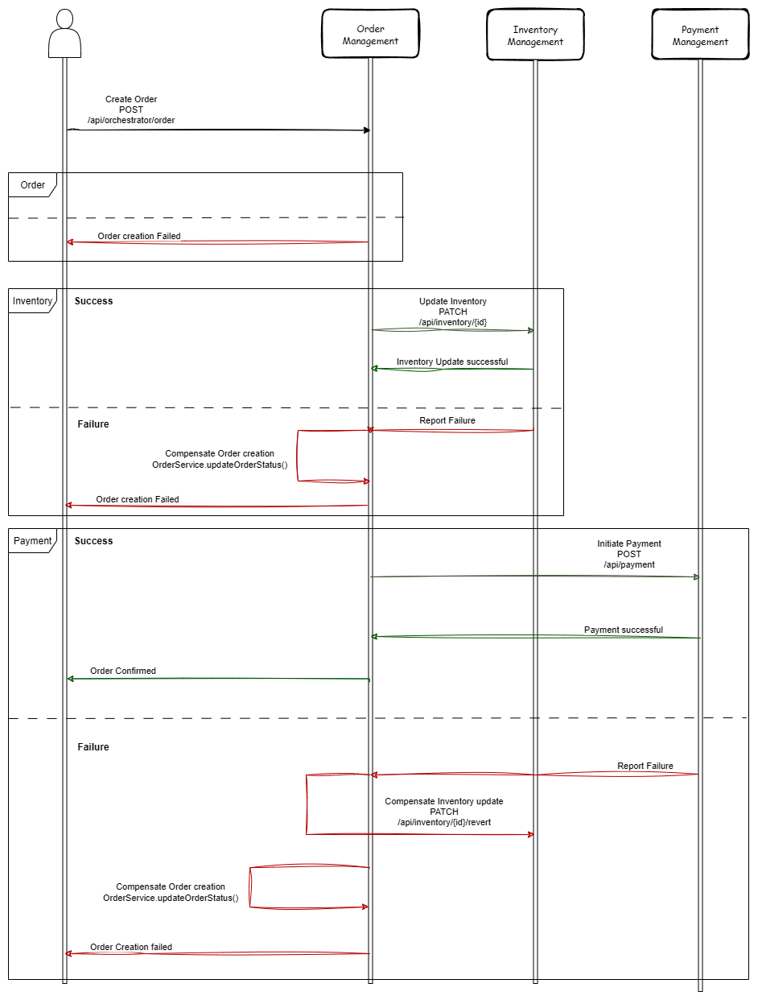

# Mini E-Commerce application

## Goal

This backend project is a mini eCommerce application built using Spring Boot microservices. It demonstrates transaction
management using the Saga pattern with orchestration. The application consists of three core services: Order Service,
Inventory Service, and Payment Service.

## Tech stack used

1. Java 17
2. SpringBoot 3.5.x
3. RESTful APIs
4. PostgreSQL

## Design patterns used

1. **Saga pattern with orchestration** for managing distributed transactions across our microservices. In this pattern,
   a central orchestrator coordinates the transaction flow by invoking each service in sequence and handling success or
   failure scenarios.
2. **Database per service** We have separate DB for each microservice, for better failure isolation (i.e. failure of one
   service DB is isolated from other services DB) and better data encapsulation since each service handles its data
   internally, exposing only necessary data through APIs.

### Why Saga Orchestration?

- **Centralized Control**: The orchestrator provides a clear view of the transaction flow, making it easier to manage
  and debug.
- **Robust Failure Handling**: Compensating actions (e.g., refunding payments, reverting inventory) are triggered by the
  orchestrator in case of failures.
- **Scalability**: The orchestrator can be scaled independently and optimized for performance.
- **Learning Purpose**: This pattern is ideal for understanding transaction management in distributed systems,
  especially in e-commerce scenarios where consistency and reliability are critical.
- Easier to scale, monitor, and test independently.
- Reusable for multiple workflows (e.g., order creation, returns, refunds).

This design choice helped us explore real-world challenges in microservice communication and transaction consistency.

### Why not Saga Choreography?

- **Debugging**: It would be hard to track the requests, especially when there is no central manager/orchestrator.
- **Managing**: As more and more features are added, understanding the complete flow of events becomes difficult.

## Sequence diagram

## API Contract

1. [Order Microservice](Order-MS)- Order management microservice
   ### Order Service API Endpoints
   | Method | Endpoint                   | Description                                             |
   |:-------|:---------------------------|:--------------------------------------------------------|
   | POST   | `/api/orchestrator/order`  | Create an order. **Body:** `{}`                         |
   | GET    | `/api/order/{id}`          | Get details of an order                                 |
   | PATCH  | `/api/order/{id}/cancel`   | For user to cancel the order                            |
   
   **NOTE**: Below things are assumed while making DTOs(To keep project as simple as possible).  
   1. 1 Order = 1 Product.
   2. Orchestrator is inside Order-MS.

2. [Inventory Microservice](Inventory-MS)- Inventory management microservice
   ### Inventory Service API Endpoints
   | Method | Endpoint                     | Description                       |
   |:-------|:-----------------------------|:----------------------------------|
   | GET    | `/api/inventory/{id}`        | Get inventory status of a product |
   | POST   | `/api/inventory/products`    | Add new products                  |
   | PATCH  | `/api/inventory/{id}`        | Update inventory stock status     |
   | PATCH  | `/api/inventory/{id}/revert` | Revert inventory stock info       |

3. [Payment Microservice](Payment-MS)- Payment management microservice
   ### Payment Service API Endpoints
   | Method  | Endpoint                           | Description                               |
   |:--------|:-----------------------------------|:------------------------------------------|
   | POST    | `/api/payment`                     | Initiate payment                          |
   | GET     | `/api/payment/{id}`                | Get payment details using payment ID      |
   | POST    | `/api/payment/{id}/refund`         | Initiate payment refund                   |

### Improvements that can be done-

1. Converting to Event-based Architecture
2. If the application grows larger, we can even segregate Orchestrator to new Orchestrator-MS
3. Introduce retry mechanisms for certain cases
4. Ensure Idempotency of the endpoints by sending and tracking things like UUID with each request.
5. Audit table in Inventory MS to track change in inventory (Track orderId, quantity, and modificationReason)
6. One order can have multiple Products
7. Suggest the User if stock is less than what quantity he wants i.e., user wants 10 Apples, but we have 5 only
